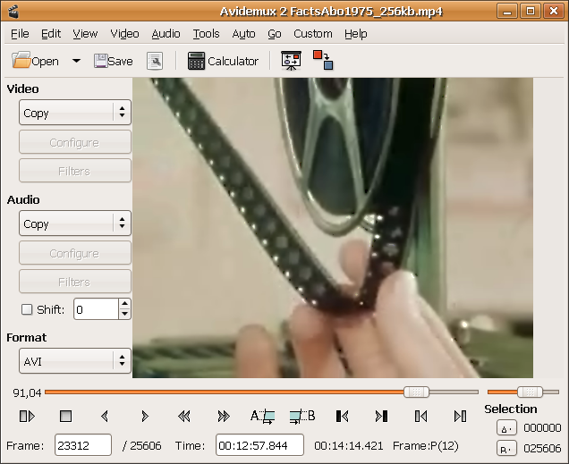

# ICT in Education

### Jaén, Febrero 2017

### English Matters

## Productivity Tools for Teaching and Learning in Class

### José Antonio Vacas @javacasm

## https://goo.gl/idGJpn

# Open Source Tools

* Great software: Everybody can test & improve
* Easy to use (very similar to similar softwares)
* It is totaly free

## Some examples...

### Office works: [OpenOffice](https://www.openoffice.org/es/)

* SpreadSheet
* Writer (docs)
* Draws
* Presentation

[Documentation](https://www.openoffice.org/es/soporte/documentacion.html)

### Editing Images: [Gimp](http://www.gimp.org/)

* Filters
* Cut & Paste
* Convert between formats

[Tutorials](http://www.gimp.org/tutorials/) [video tutorial](https://www.youtube.com/watch?v=P143GdVeMjE)

### Editing video: [Avidemux](http://fixounet.free.fr/avidemux/)

* Filters
* Cut & Paste
* Convert between formats

[Video tutorial](https://www.youtube.com/watch?v=X23I2BZ4J5A)

### Editing sound: [Audacity](http://audacityteam.org/?lang=en)

  * Filters
  * Cut & Paste
  * Convert between formats

  [Vídeo tutorial](https://www.youtube.com/watch?v=3uqCNjbQn54)

### 2D Designing: [InkScape](https://inkscape.org/en/)

[Video tutorial](https://www.youtube.com/watch?v=Pd02Q-54wuQ)

### 3D Designing: [Freecad](www.freecadweb.org/)

[Video tutorials](https://www.youtube.com/watch?v=_HEvhclR4-o&list=PL6fZ68Cq3L8k0JhxnIVjZQN26cn9idJrj)

### Animations: [Blender](https://www.blender.org/)

* 3D Designing
* Creating [Movies](http://archive.blender.org/features-gallery/movies/)
    * Animations [Sintel](https://www.youtube.com/watch?v=eRsGyueVLvQ)
    * Human & Animations [Tears of steels](https://www.youtube.com/watch?v=R6MlUcmOul8)

## There are some [tools to make](makers.md)
