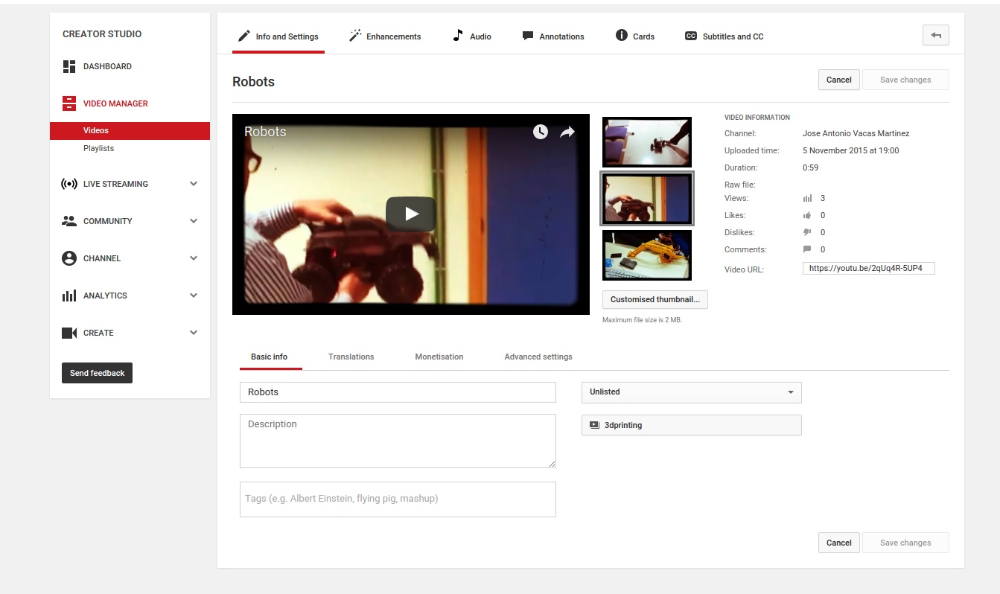
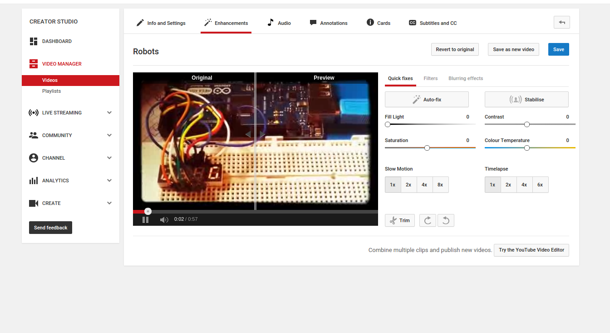
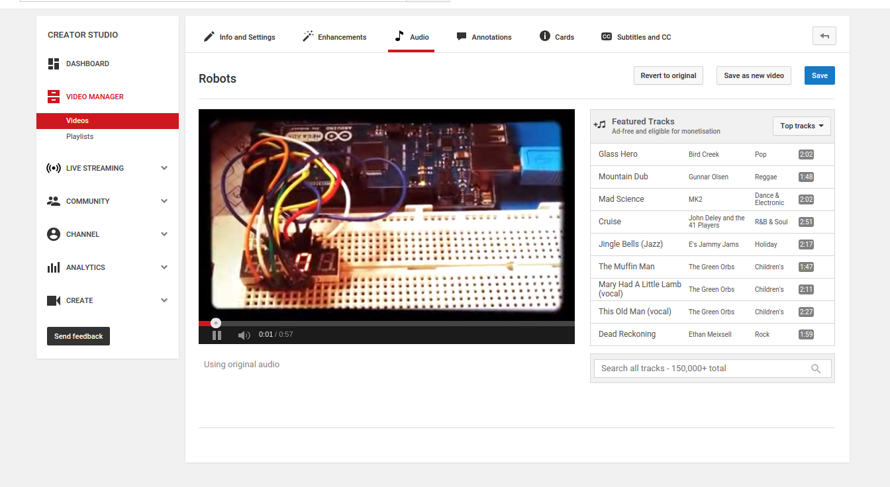
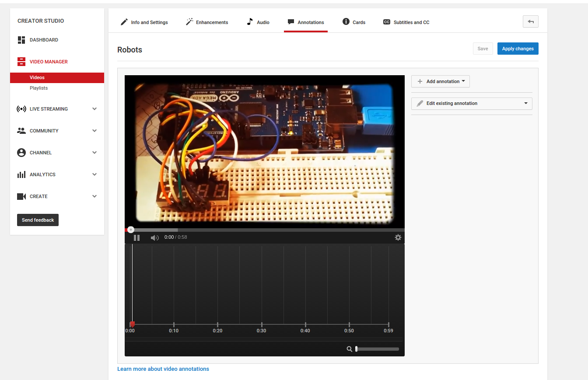
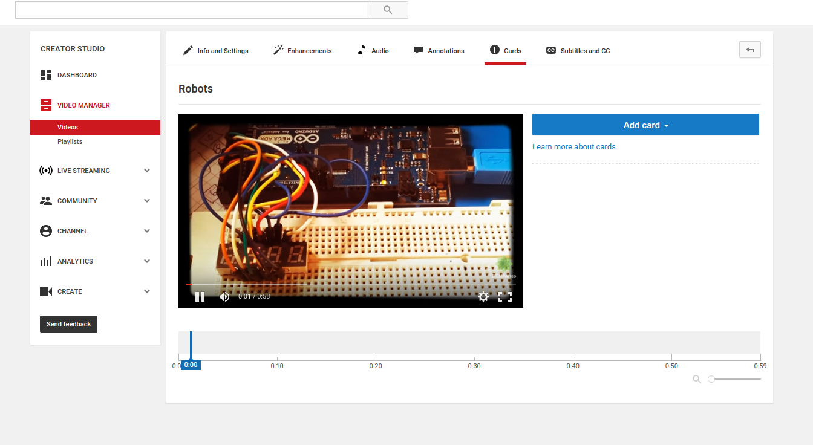
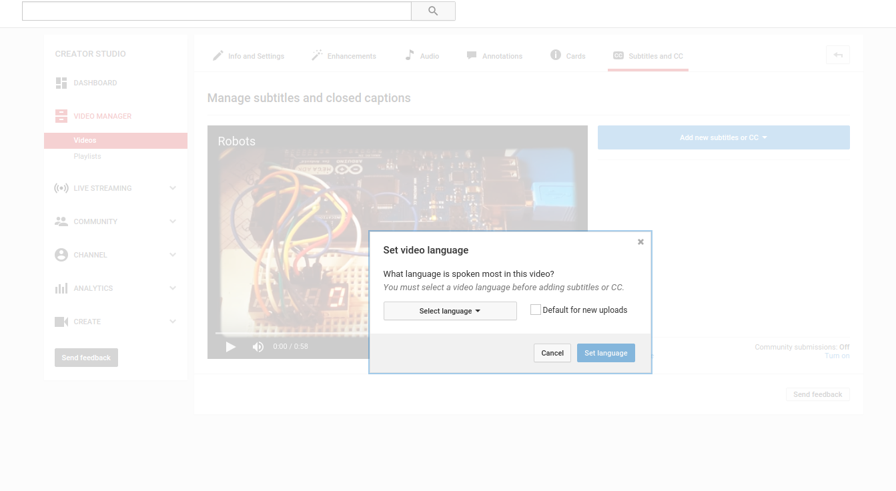

# ICT in Education

### Jaén, Febrero 2017

### English Matters

## Productivity Tools for Teaching and Learning in Class

### José Antonio Vacas @javacasm

## https://goo.gl/lXtyNz

# youtube

## [How big is Youtube](http://expandedramblings.com/index.php/youtube-statistics/)?

### Youtube is a publishing tools, with a easy editing tool

#### You need a acount

#### youtube -> My channel -> Video Manager -> Create

### Steps to edit a video

#### Upload your video

#### Create your own video [Getting Started](https://www.youtube.com/yt/creators/get-started.html)

####  [Tutorial](https://www.youtube.com/watch?v=Hsuy4cUJe9o)
### [Make  videos like a pro](https://www.youtube.com/watch?v=At4QdGdwI7o)

## Video info

### Privacy

#### Public: everybody can watch and find

#### Hidden: anybody that get the URL (cannot find)

#### Private: you choose who will see

##  Improve your video quality

## Adding Audio (music)

## Adding Annotations

## Add Cards (links to other videos)

## Add Subtitles

